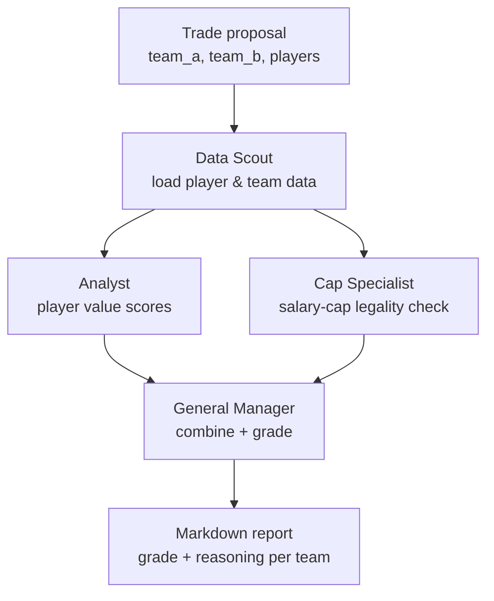
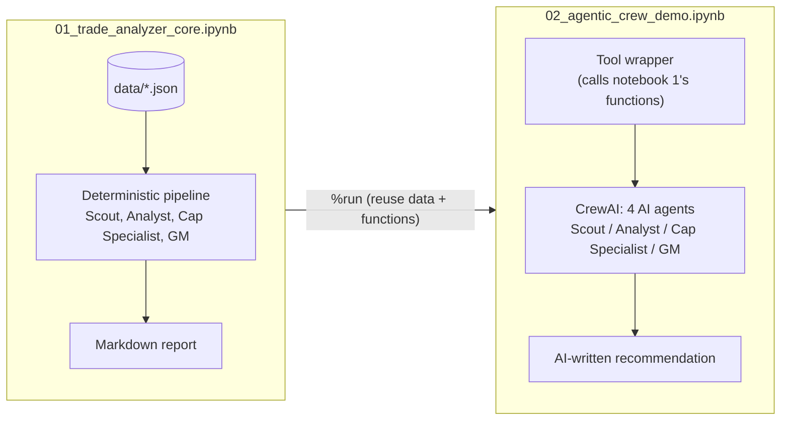

# AI Multi-Agent Sports Trade Analyzer — Design Document

## 1. Idea

Evaluating a pro-sports trade is really several smaller jobs done by
different specialists: someone has to know the player data, someone has to
judge whether the players are actually good value, and someone has to check
the trade against the league's financial rules before it can even happen.

Instead of writing one large function that does all three, this project
splits the work into four small, single-purpose "agents" that each do one
job and hand their result to the next one — the same shape as a real NBA
front office, and a common pattern in **agentic coding**: break a task into
roles, give each role a narrow responsibility, and let them collaborate in
sequence.

The project makes a second, deliberate point: **the math should never be
left to an AI model.** Salary-cap rules and value scores are computed by
plain, deterministic Python (`notebooks/01_trade_analyzer_core.ipynb`) —
auditable, testable, and always gives the same answer for the same input.
An AI language model is only added afterward, as an optional layer
(`notebooks/02_agentic_crew_demo.ipynb`), to turn already-verified numbers
into a written recommendation. The AI adds explanation and judgment; it
never invents a number.

## 2. Example

Input — a proposed trade:

```json
{
  "team_a": "BOS",
  "team_b": "LAL",
  "team_a_sends": ["Jrue Holiday"],
  "team_b_sends": ["D'Angelo Russell", "Gabe Vincent"]
}
```

Output — the generated report:

```
# Trade Analysis Report
Proposed trade: BOS sends Jrue Holiday to LAL for D'Angelo Russell, Gabe Vincent.

## Boston Celtics (BOS) -- Grade: A
- Spending level: Under the Salary Cap (payroll $151,250,500)
- Trade allowed: YES (outgoing $32,400,000, incoming $29,492,000, max allowed $35,796,500)
- Value analysis: acquired 74.2, gave up 32.5, net +41.7
- Roster before trade: average age 30.4, positions {'SG': 1, 'PG': 2, 'C': 1, 'SF': 1}

## Los Angeles Lakers (LAL) -- Grade: D
- Spending level: Under the Salary Cap (payroll $113,919,000)
- Trade allowed: YES (outgoing $29,492,000, incoming $32,400,000, max allowed $70,220,000)
- Value analysis: acquired 32.5, gave up 74.2, net -41.7
- Roster before trade: average age 28.8, positions {'PF': 2, 'PG': 2, 'SG': 1}
```

And a second example showing a trade the Cap Specialist rejects, with a
suggested fix:

```
## Boston Celtics (BOS) -- Grade: F (Not Allowed)
- Spending level: Over the Second Apron (payroll $242,000,800)
- Trade allowed: NO (outgoing $94,729,280, incoming $18,692,000, max allowed $94,729,280)
  - Problem: Teams at the strictest spending level cannot combine several
    outgoing players' salaries into one trade.
- Suggested fix: (none needed here -- the salary side was fine, only the
  "combining players" rule was broken)
```

Notebook 2 takes this same result and asks an AI model to turn it into a
fuller written recommendation, without changing the grade or the numbers.

## 3. High-Level Architecture



The two notebooks sit on top of the same pipeline:



Notebook 2 never recomputes the numbers — it calls into notebook 1's
already-verified functions through one tool, so the AI agents' final grades
always match notebook 1's exactly.

## 4. Agent Roles

| Agent | Responsibility | Reads | Produces | Implemented as |
|---|---|---|---|---|
| **Data Scout** | Load accurate roster, salary, and stat data for the teams involved | `data/sample_players.json`, `data/cap_rules.json` | Team rosters, per-player salary/age/stats | `find_player()`, `team_payroll()` |
| **Analyst** | Score each player's value, adjusted for age; summarize the trade's value trade-off | Player records | 0–100 value score per player, net value score per team | `age_multiplier()`, `player_value_score()`, `analyze_team_needs()`, `trade_impact_summary()` |
| **Cap Specialist** | Check the trade against salary-cap/luxury-tax/apron rules; explain and suggest fixes for violations | Team payroll, outgoing/incoming salary, player count | Allowed/not-allowed verdict, list of problems, suggested fix | `team_cap_status()`, `check_trade_legality()`, `suggest_balancing_move()` |
| **General Manager** | Combine all of the above into one final graded report, no new calculation of its own | Outputs of the other three agents | Letter grade per team, full markdown report | `_grade()`, `run_trade_analysis()`, `render_markdown_report()` |

In notebook 2, each of these becomes a `crewai.Agent` with a role, goal, and
backstory, and a `crewai.Task` that runs in sequence, each one able to see
the previous task's output (`context=[...]`). All four share one tool,
`run_full_trade_analysis_tool`, which is the only bridge between the AI
agents and the deterministic pipeline — the agents can read its result, but
cannot bypass it to compute their own numbers.

## 5. Low-Level Design

### Data model

`data/sample_players.json`
```json
{
  "teams": {
    "BOS": {
      "name": "Boston Celtics",
      "roster": [
        {"name": "Jaylen Brown", "position": "SG", "age": 29,
         "salary": 49205800, "contract_years_remaining": 4,
         "per": 21.6, "win_shares": 8.4}
      ]
    }
  }
}
```

`data/cap_rules.json`
```json
{
  "season": "2025-26",
  "salary_cap": 154647000,
  "luxury_tax_line": 187895000,
  "first_apron": 195945000,
  "second_apron": 207824000
}
```

### Player value score

```
age_multiplier(age)   -> looked up from a fixed table, peaks at 1.00 around age 25-27
raw_score              = per * 2.2 + win_shares * 3.0
player_value_score      = min(raw_score * age_multiplier(age), 100), rounded to 1 decimal
```

`trade_impact_summary(players_in, players_out)` sums `player_value_score`
across each list and returns `value_acquired`, `value_surrendered`, and
`net_value_score = value_acquired - value_surrendered`.

### Cap status and legality

```
team_cap_status(payroll):
    payroll < salary_cap          -> UNDER_CAP
    payroll < luxury_tax_line     -> OVER_CAP_UNDER_TAX
    payroll < first_apron         -> TAXPAYER
    payroll < second_apron        -> FIRST_APRON
    else                          -> SECOND_APRON
```

Salary-matching limit by status:

| Status | Max incoming salary allowed |
|---|---|
| Under the cap | `cap_room + outgoing_salary`, where `cap_room = salary_cap - payroll` |
| Over the cap / taxpayer | outgoing ≤ $7.5M → `outgoing * 2.00 + $250k`; ≤ $29M → `outgoing * 1.75 + $250k`; else → `outgoing * 1.25 + $250k` |
| First apron | `outgoing_salary + $250,000`, and outgoing player count must be 1 |
| Second apron | `outgoing_salary` exactly, and outgoing player count must be 1 |

`check_trade_legality(...)` computes the applicable limit, compares it to
the proposed incoming salary, and returns a `TradeLegalityResult` (a
dataclass: `legal`, `cap_status`, `outgoing_salary`, `incoming_salary`,
`max_incoming_allowed`, `violations: list[str]`).

`suggest_balancing_move(result)` — if illegal, computes
`gap = incoming_salary - max_incoming_allowed` and returns a one-line
suggestion naming the team and the dollar amount it needs to shed.

### Grading

```
grade(net_value_score, legal):
    not legal        -> "F (Not Allowed)"
    net >= 15         -> "A"
    net >= 7          -> "B+"
    net >= 2          -> "B"
    net >= -2         -> "C+"
    net >= -7         -> "C"
    else               -> "D"
```

### Pipeline entry point

```
run_trade_analysis(trade, teams, cap_rules) -> {
    "trade": trade,
    "teams": {
        team_a: {team_name, payroll_before, legality, balancing_suggestion,
                 needs_before, impact, grade},
        team_b: { ...same shape... },
    },
}
```

`render_markdown_report(result)` turns that dictionary into the markdown
report shown in section 2.

### Notebook 2's tool boundary

```
run_full_trade_analysis_tool(trade_json: str) -> str:
    trade = json.loads(trade_json)
    result = run_trade_analysis(trade)              # same function as notebook 1
    report = render_markdown_report(result)
    return json.dumps({"summary": {...}, "report": report})
```

This is the single point of contact between the AI agents and the
deterministic engine — every agent task is given this same tool, so no
agent can produce a grade or a dollar figure that didn't come from
`run_trade_analysis`.

### File layout

```
data/
  cap_rules.json          # salary cap / tax / apron thresholds
  sample_players.json     # offline roster + salary + stat dataset
notebooks/
  01_trade_analyzer_core.ipynb   # Idea -> deterministic engine (sections 4-5 above, as code)
  02_agentic_crew_demo.ipynb     # AI agent layer on top, via CrewAI
.env.example / .env       # GEMINI_API_KEY / ANTHROPIC_API_KEY (see README)
```
